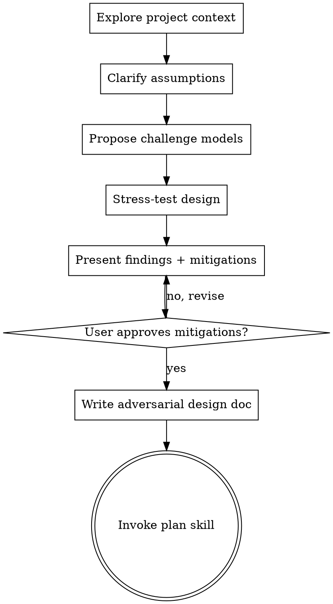

# Adversarial Brainstorming

## Overview

Pressure-test ideas and designs through adversarial analysis before implementation.

Find what can fail, how it fails, and what safeguards are needed. Prioritize discovering hidden assumptions, edge cases, abuse paths, operational risks, and rollback gaps.

<HARD-GATE>
Do NOT invoke any implementation skill, write any code, scaffold any project, or take any implementation action until you have presented adversarial findings and the user has approved the mitigations.
</HARD-GATE>

## Anti-Pattern: "Happy Path Means Safe"

Treat all designs as vulnerable until challenged. "Simple" changes still need failure-mode analysis because small assumptions cause large regressions.

## Checklist

You MUST create a task for each of these items and complete them in order:

1. **Explore project context deeply** — check files, docs, recent commits
2. **Clarify assumptions** — ask one question at a time about constraints, trust boundaries, and success criteria
3. **Generate challenge models** — propose 2-3 adversarial lenses with trade-offs and recommendation
4. **Stress-test the design** — identify edge cases, failure modes, abuse paths, and operational hazards
5. **Present adversarial review** — show findings and mitigations in sections scaled to complexity, get user approval after each section
6. **Write adversarial design doc** — save to `<agent-settings-directory(.claude|.agents|.codex)>/plans/YYYY-MM-DD-<topic>-adversarial-design.md` and commit
7. **Transition to implementation planning** — invoke plan skill

## Process Flow

**The terminal state is invoking plan.** Do NOT invoke any implementation skill. The ONLY skill you invoke after adversarial brainstorming is plan.

## The Process

**Understanding and pressure-testing the idea:**
- Check the current project state first (files, docs, recent commits)
- Ask one question per message to isolate assumptions and blind spots
- Prefer multiple choice questions when possible
- Focus on failure-relevant details: data consistency, access control, concurrency, latency, observability, rollback

**Exploring challenge models:**
- Propose 2-3 adversarial lenses with trade-offs
- Lead with your recommended lens and explain why
- Typical lenses: malicious actor, pathological user behavior, infrastructure failure, race conditions, stale state, dependency outage

**Presenting adversarial review:**
- Present findings and mitigations once the risk model is clear
- Scale each section to complexity: short for straightforward, deeper for nuanced areas
- Ask after each section whether it looks right so far
- Cover: attack/failure scenarios, blast radius, detection signals, guardrails, fallback behavior, test strategy

## After the Adversarial Review

**Documentation:**
- Write the validated adversarial design to `<agent-settings-directory(.claude|.agents|.codex)>/plans/YYYY-MM-DD-<topic>-adversarial-design.md`

**Implementation planning:**
- Invoke the plan skill to create a detailed implementation plan
- Do NOT invoke any other skill. plan is the next step.

## Key Principles

- **Assume failure by default** - Challenge happy-path assumptions
- **One question at a time** - Isolate variables and reduce ambiguity
- **Prioritize by impact and likelihood** - Address highest-risk paths first
- **Design for recovery** - Include detection, rollback, and containment
- **Explore alternatives** - Compare 2-3 stress-tested approaches before settling
- **Incremental validation** - Present findings, get approval, then proceed
